# I - Introduction à ExpressJS

## Exercice 1

Créer un serveur ExpressJS simple

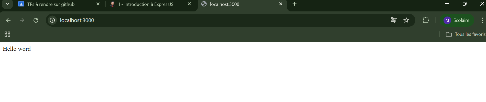

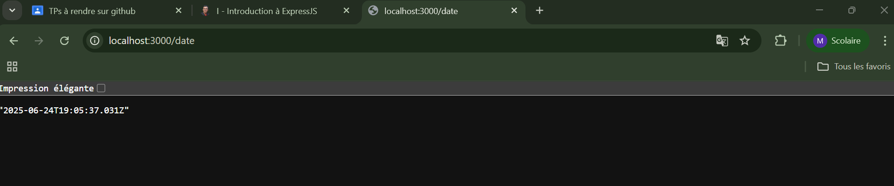

## Exercice 2

Configuration d'un projet ExpressJS

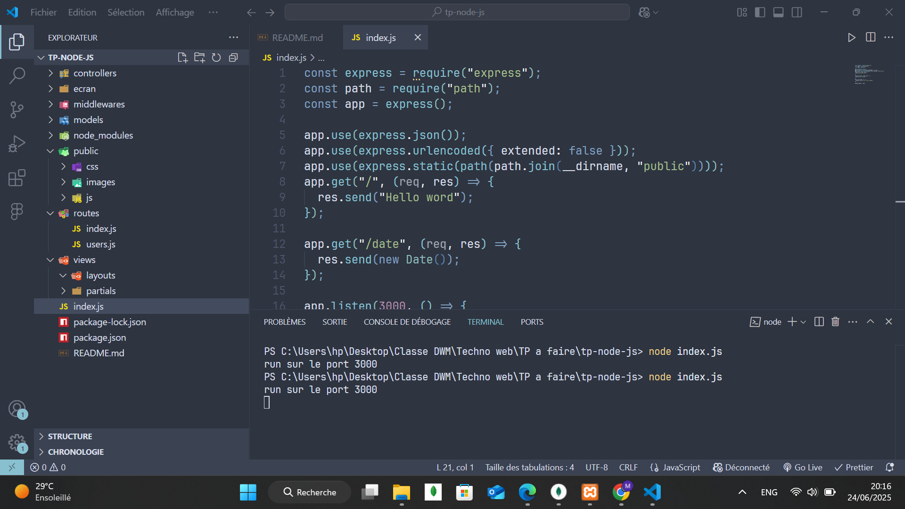

# II - Routage avec ExpressJS

## Exercice 1

Créer un ensemble de routes pour une API de gestion de tâches

Récupérer toutes les tâches

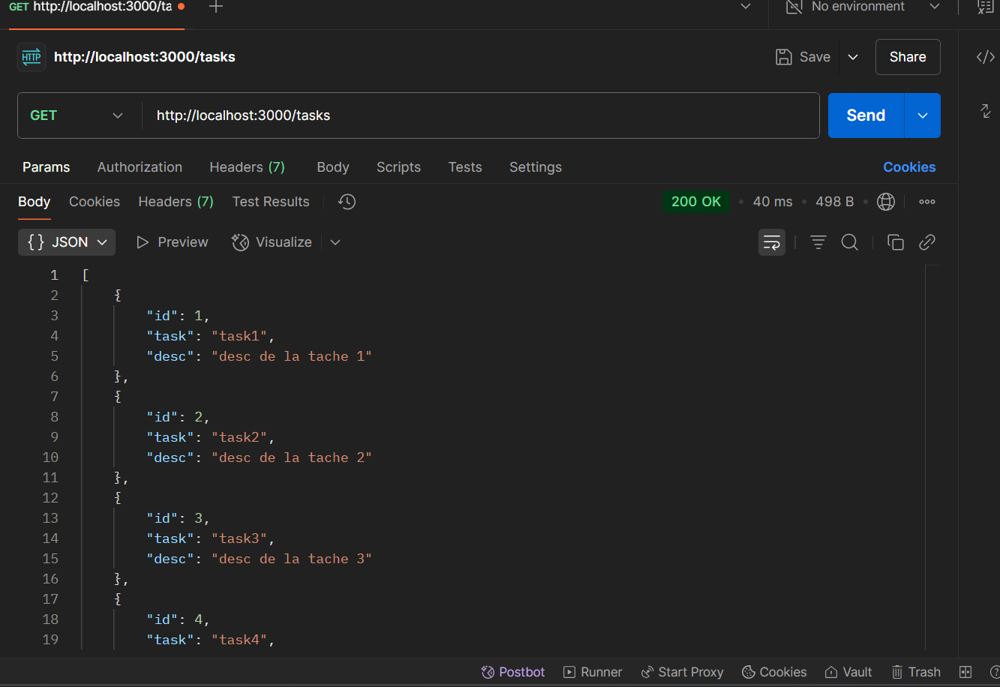

Récupérer une tâche spécifique

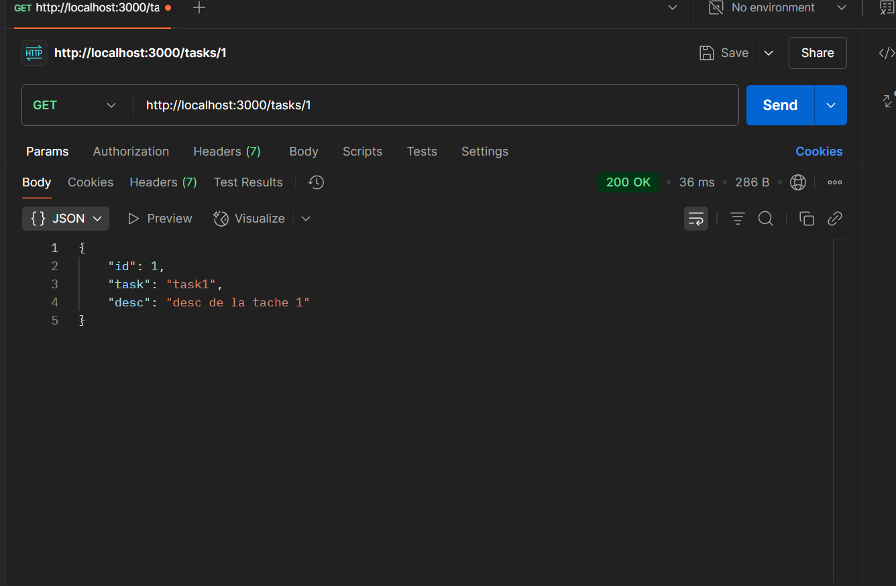

Créer une nouvelle tâche

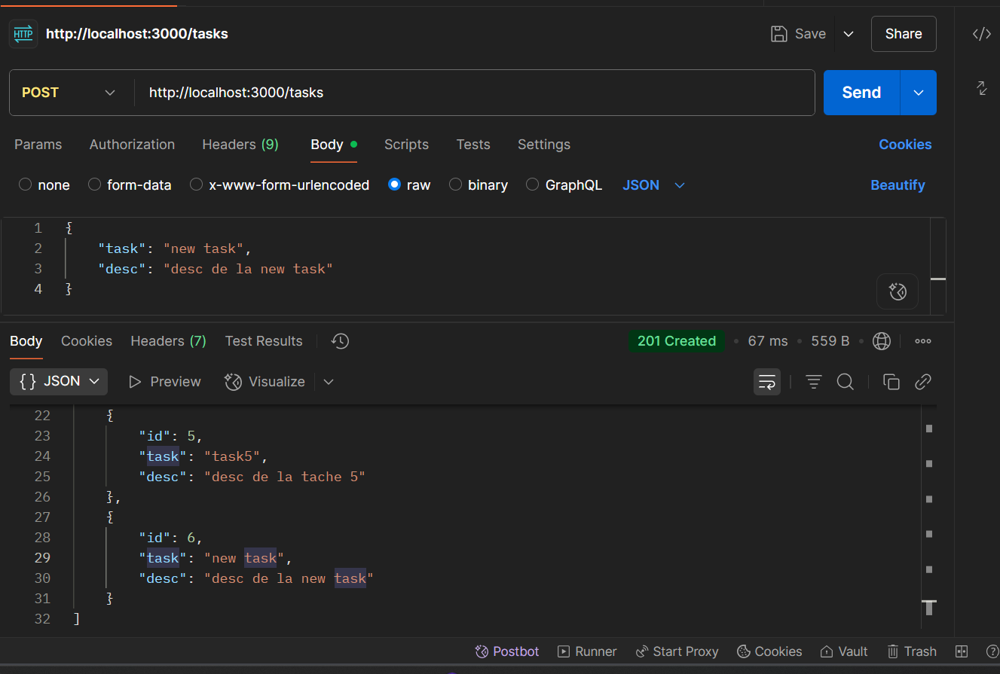

Mettre à jour une tâche existante

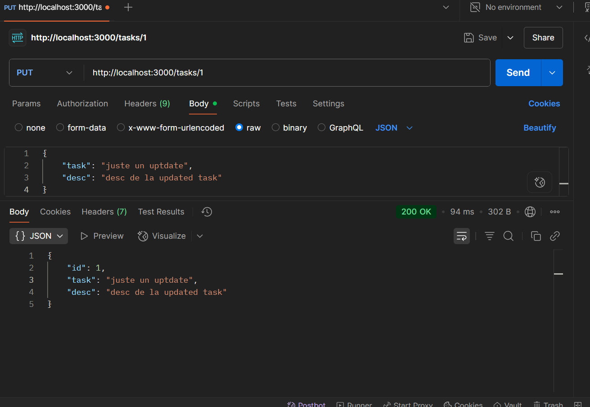

Supprimer une tâche

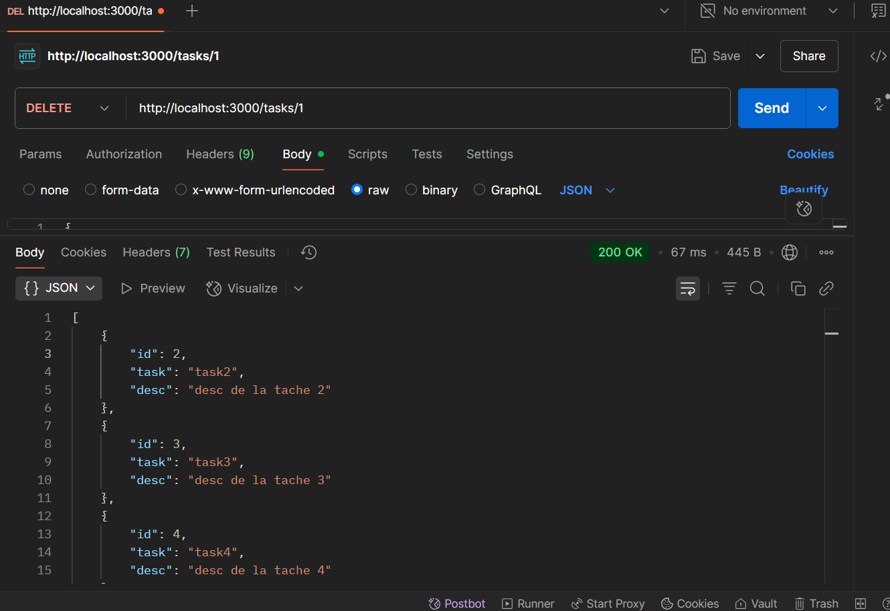

## Exercice 2

Créez une API pour un blog avec des routes paramétrées :

Récupérer les articles d'une année et optionnellement d'un mois spécifique

je sais pas pourquoi mais mon express n'arrive pas a supporter les parametres optionnel donc j'ai cree deux route distinct

pour get /posts/:year/

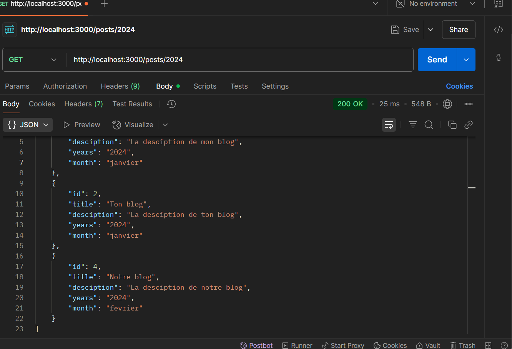

pour get /posts/:year/month

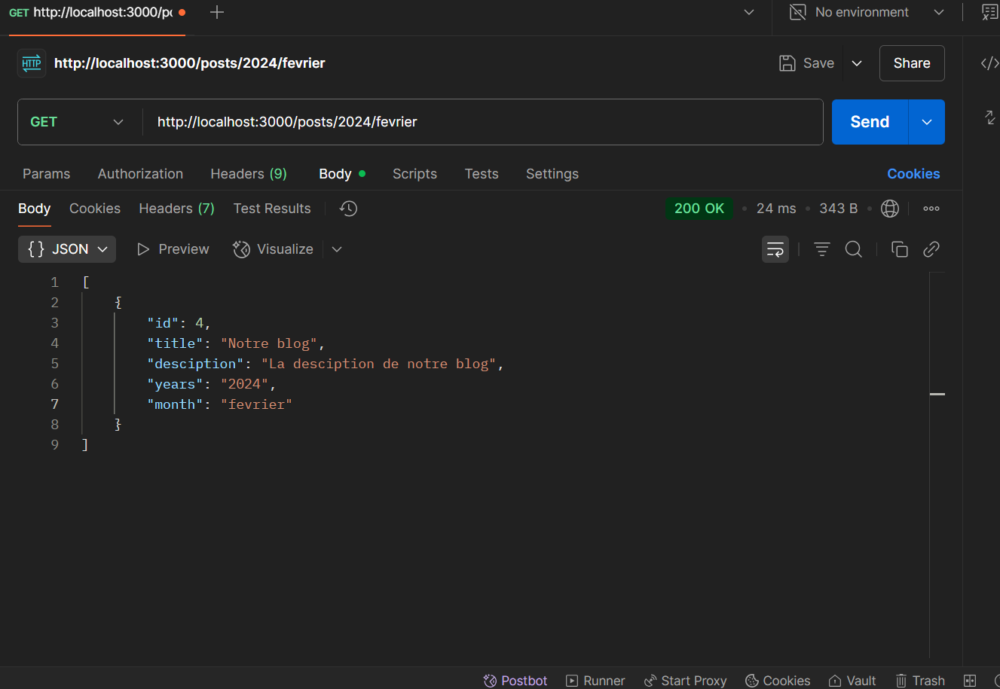

Récupérer les articles d'une catégorie spécifique

/categories/:categoryName/posts

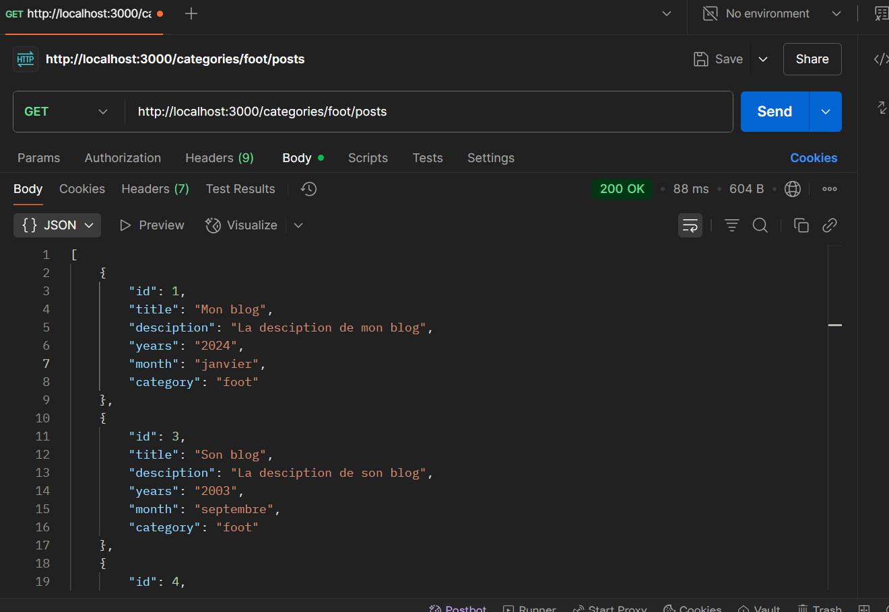

## Exercice 3

Organiser une application avec des routeurs modulaires
le screenshot est un exemple de la route blog separe dans les dossier controller , routes et index.js

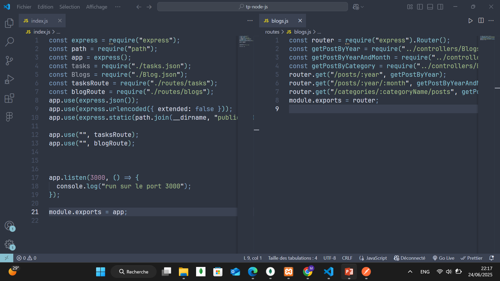

# II - Les Middlewares dans ExpressJS

## Exercice 1

Créer un middleware de logging personnalisé

log de url /posts/2022

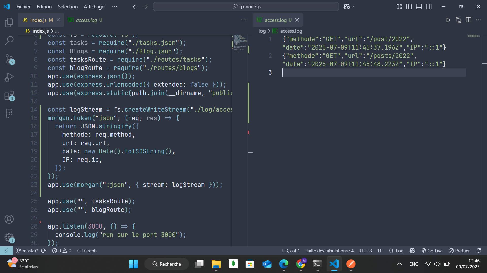

## Exercice 3

Intégrer plusieurs middlewares tiers

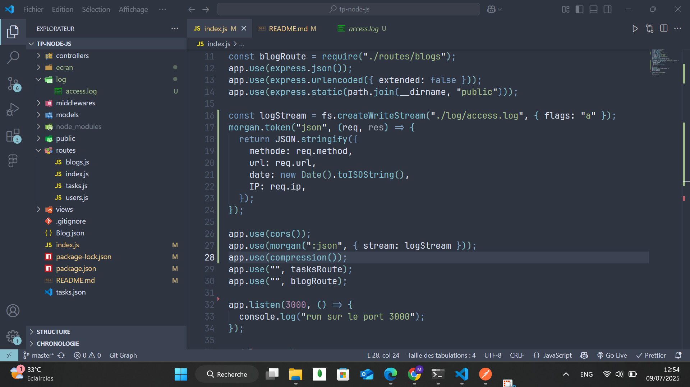
